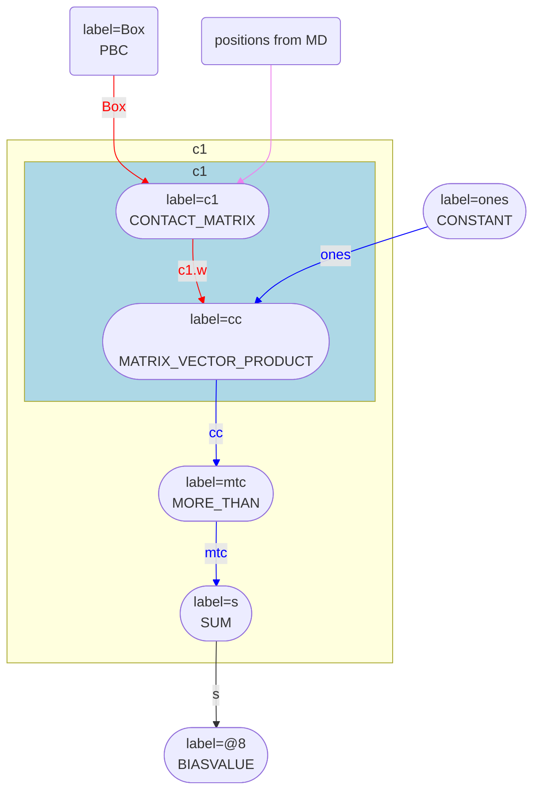
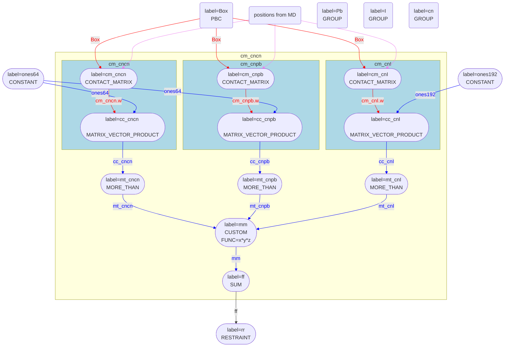

# Contact matices and coordination numbers

The $i$, $j$ element of the conntact matrix, $\mathbf{C}_{ij}$, is one if atoms $i$ and $j$ are within a certain distance $r_c$ of each other and zero otherwise.
Consequently, if $\mathbf{C}$ is multiplied from the back by a vector of ones the $i$th element of the resulting matrix tells you the number of atoms that are 
within $r_c$ of atom $i$.  In other words, the coordination numbers of the atoms can be calculated from the contact matrix by doing matrix vector multiplication.

This realisation about the relationship between the contact map and the coordination number is heavily used in the new version of PLUMED.  For example, to calculate 
and print the coordination numbers of the first 7 atoms in the system with themselves you would use an input something like this:

```plumed
c1: CONTACT_MATRIX GROUP=1-7 SWITCH={RATIONAL R_0=2.6 NN=6 MM=12}
ones: ONES SIZE=7
cc: MATRIX_VECTOR_PRODUCT ARG=c1.w,ones
PRINT ARG=cc FILE=colvar
```

Implmenting the coordination number this way is useful as there are many different ways to define whether two atoms/molecules and to construct a "contact" matrix based on 
the result.  For example:

* You could say that two molecules are connected if they are within a certain distance of each other and if they have the same orientation.
* You could say that two water molecules are connected if they are hydrogen bonded to each other.
* You could say that two atoms are connected if they are within a certain distance of each other and if they have similar values for a CV.

When the coordination numbers is implemented in the way described above (by doing the matrix-vector multiplication) you have the flexibility to define the contact matrix that 
is used in the multiplication in whatever way you choose.  In other words, the newer implementation of the coordination number is much more flexible.

## Contact map chains

As discussed on [this page](MultiColvar.md), PLUMED avoids storing the derivatives for each element of a vector by creating a chain of actions instead of passing the vectors.  
We also use these chains of actions when passing matrices.  When we compute the CV defined by the input below:

```plumed
# Calculate the contact matrix for the first seven atoms in the system
c1: CONTACT_MATRIX GROUP=1-7 SWITCH={RATIONAL R_0=2.6 NN=6 MM=12}
# Calculate the coordination numbers for the first seven atoms in the system
ones: ONES SIZE=7
cc: MATRIX_VECTOR_PRODUCT ARG=c1.w,ones
# Set the ith element of the vector mtc equal to one if the coordination number of atom i is greater than 3.
mtc: MORE_THAN ARG=cc SWITCH={RATIONAL D_0=3 R_0=1}
# Calculate the number of atoms with a coordination number greater than 3.
s: SUM ARG=mtc PERIODIC=NO
# Add a bias on s that is equal to the value of s
BIASVALUE ARG=s
```

for example, the diagram showing how data passes through the PLUMED actions as the values and derivatives are calculated is as follows:



Notice that the CONTACT_MATRIX, MATRIX_VECTOR_PRODUCT, MORE_THAN and SUM actions are all in the same subgraph.  The grouping of these actions indicates that the 
first row of the contact matrix is calculated at the same time as the first elements of the vectors with labels cc and mtc.  In other words, PLUMED only starts calculating 
the second row of the matrix with label c1 once the first element of the vector mtc has been added to the scalar s.  Furthermore, the derivatives of s with respect to the 
atoms input to c1 are accumulated during the forward loop.  Consequently, when the forces from the biasvalue are applied on s they are passed through the actions as shown below:

```mermaid
flowchart BT
8(["label=#64;8
 BIASVALUE
"])
8 -- s --> s
subgraph subc1 [c1]
subgraph subc1_mat [c1]
c1(["label=c1
 CONTACT_MATRIX
"])
cc(["label=cc
 MATRIX_VECTOR_PRODUCT
"])
end
style subc1_mat fill:lightblue
c1 -. c1.w .-> cc
linkStyle 1 stroke:red,color:red;
mtc(["label=mtc
 MORE_THAN
"])
cc -. cc .-> mtc
linkStyle 2 stroke:blue,color:blue;
s(["label=s
 SUM
"])
mtc -. mtc .-> s
linkStyle 3 stroke:blue,color:blue;
end
s == s ==> c1
s == s ==> cc
subgraph subc1 [c1]
end
cc -- ones --> ones
linkStyle 6 stroke:blue,color:blue;
ones(["label=ones
 CONSTANT
"])
Box("label=Box
 PBC
")
c1 -- Box --> Box
linkStyle 7 stroke:red,color:red;
c1 --> MD
linkStyle 8 stroke:violet,color:violet;
MD(positions from MD)
```

In short, we do not need to calculate the matrix elements of c1 twice in order to apply the forces as we accumulate the derivatives of the final scalar s during the forward loop.

## Optimisation details

The contact matrix is sparse.  Each atom is only be connected to a small number of neighbours and the vast majority of the elements of the contact matrix are thus zero.  To reduce 
the amount of memory that PLUMED requires I have thus implemented sparse matrix storage.  If you do calculate and store a contact matrix only the elements of the matrix that are 
non-zero are stored.

We can also use the sparsity of the contact matrix to make the time required to compute a contact matrix scale linearly rather than quadratically with the number of atoms.  Element 
$i,j$ of the contact matrix is only non-zero if two atoms are within a cutoff, $r_c$.  We can determine that many pairs of atoms are further appart than $r_c$ without computing the 
distance between these atoms by using divide and conquer strategies such as linked lists and neighbour lists.  These optimisation tricks are implemented in the base class AgencyMatrixBase.  
This class therefore ensures that only the subset of elements of the contact matrix that are definitely non-zero are computed.  Furthermore, because coordination numbers are computed 
within the chain of actions only the non-zero elements of the matrix are propegated onwards through the chain when we multiply by the vector of ones.  In the flowchart diagrams that I have 
shown previously the blue subgraphs illustrate how data is passed through actions as the elements of the matrix row are evaluated.

## A complicated CV

Consider the CV that was used to study perovskite nucleation in [this paper](https://pubs.acs.org/doi/abs/10.1021/acs.chemmater.9b04259).  The CV here measures the number of 
methylamonium molecules that are attached to at least 5 other methylamoniusm molecules, at least 7 lead atoms and at least 11 ionide ions.  We can calculate something akin to this 
CV and apply a restraint on the resulting quantity by using the following input file:

```plumed
# Lead ions
Pb: GROUP ATOMS=1-64
# Iodide atoms
I: GROUP ATOMS=65-256  
# Methylamonium "atoms" -- in the real CV these are centers of mass rather than single atoms
cn: GROUP ATOMS=257-320

ones64: ONES SIZE=64
# Contact matrix that determines if methylamonium molecules are within 8 A of each other
cm_cncn: CONTACT_MATRIX GROUP=cn SWITCH={RATIONAL R_0=0.8}
# Coordination number of methylamounium with methylamonium
cc_cncn: MATRIX_VECTOR_PRODUCT ARG=cm_cncn.w,ones64
# Vector with elements that are one if coordiantion of methylamonium with methylamonium >5
mt_cncn: MORE_THAN ARG=cc_cncn SWITCH={RATIONAL R_0=5 NN=12 MM=24}

# Contact matrix that determines if methylamoinium moleulcule and Pb atom are within 7.5 A of each other
cm_cnpb: CONTACT_MATRIX GROUPA=cn GROUPB=Pb SWITCH={RATIONAL R_0=0.75}
# Coordination number of methylamonium with Pb
cc_cnpb: MATRIX_VECTOR_PRODUCT ARG=cm_cnpb.w,ones64
# Vector with elements that are one if coordination of methylamounium with lead is >7
mt_cnpb: MORE_THAN ARG=cc_cnpb SWITCH={RATIONAL R_0=7 NN=12 MM=24}

ones192: ONES SIZE=192
# Contact matrix that determines if methylamoinium moleulcule and I atom are within 6.5 A of each other
cm_cnI: CONTACT_MATRIX GROUPA=cn GROUPB=I SWITCH={RATIONAL R_0=0.65}
# Coordination number of methylamonium with I
cc_cnI: MATRIX_VECTOR_PRODUCT ARG=cm_cnI.w,ones192
# Vector with elements that are one if coordination of methylamounium with lead is >11
mt_cnI: MORE_THAN ARG=cc_cnI SWITCH={RATIONAL R_0=11 NN=12 MM=24}

# Element wise product of these three input vectors.
# mm[i]==1 if coordination number of corrsponding methylamounium with methylamonium is >5
# and if coordination of methylamounium with Pb is >7 and if coordination of methylamounium with I > 11
mm: CUSTOM ARG1=mt_cncn ARG2=mt_cnpb ARG3=mt_cnI FUNC=x*y*z PERIODIC=NO

# Sum of coordination numbers and thus equal to number of methylamoniums with desired coordination numbers
ff: SUM ARG=mm PERIODIC=NO

rr: RESTRAINT ARG=ff AT=62 KAPPA=10
```

When the forward loop through the actions in the above input file is performed data is passed as follows:



You can clearly see from this diagram that all the actions that are needed to calculate the final biased quantity ff are in the same subgraph.  We thus calculate the derivatives of ff with respect to the input 
atomic positions in the forward loop so the forces from the restraint can be passed backwards through the actions as follows:

```mermaid
flowchart BT 
rr(["label=rr 
 RESTRAINT 
"])
rr -- ff --> ff
subgraph subcm_cncn [cm_cncn]
subgraph subcm_cncn_mat [cm_cncn]
cm_cncn(["label=cm_cncn 
 CONTACT_MATRIX 
"])
cc_cncn(["label=cc_cncn 
 MATRIX_VECTOR_PRODUCT 
"])
end
style subcm_cncn_mat fill:lightblue
cm_cncn -. cm_cncn.w .-> cc_cncn
linkStyle 1 stroke:red,color:red;
mt_cncn(["label=mt_cncn 
 MORE_THAN 
"])
cc_cncn -. cc_cncn .-> mt_cncn
linkStyle 2 stroke:blue,color:blue;
subgraph subcm_cnpb_mat [cm_cnpb]
cm_cnpb(["label=cm_cnpb 
 CONTACT_MATRIX 
"])
cc_cnpb(["label=cc_cnpb 
 MATRIX_VECTOR_PRODUCT 
"])
end
style subcm_cnpb_mat fill:lightblue
cm_cnpb -. cm_cnpb.w .-> cc_cnpb
linkStyle 3 stroke:red,color:red;
mt_cnpb(["label=mt_cnpb 
 MORE_THAN 
"])
cc_cnpb -. cc_cnpb .-> mt_cnpb
linkStyle 4 stroke:blue,color:blue;
subgraph subcm_cnI_mat [cm_cnI]
cm_cnI(["label=cm_cnI 
 CONTACT_MATRIX 
"])
cc_cnI(["label=cc_cnI 
 MATRIX_VECTOR_PRODUCT 
"])
end
style subcm_cnI_mat fill:lightblue
cm_cnI -. cm_cnI.w .-> cc_cnI
linkStyle 5 stroke:red,color:red;
mt_cnI(["label=mt_cnI 
 MORE_THAN 
"])
cc_cnI -. cc_cnI .-> mt_cnI
linkStyle 6 stroke:blue,color:blue;
mm(["label=mm 
 CUSTOM
FUNC=x*y*z 
"])
mt_cncn -. mt_cncn .-> mm
linkStyle 7 stroke:blue,color:blue;
mt_cnpb -. mt_cnpb .-> mm
linkStyle 8 stroke:blue,color:blue;
mt_cnI -. mt_cnI .-> mm
linkStyle 9 stroke:blue,color:blue;
ff(["label=ff 
 SUM 
"])
mm -. mm .-> ff
linkStyle 10 stroke:blue,color:blue;
end
ff == ff ==> cm_cncn
ff == ff ==> cc_cncn
ff == ff ==> cm_cnpb
ff == ff ==> cc_cnpb
ff == ff ==> cm_cnI
ff == ff ==> cc_cnI
subgraph subcm_cncn [cm_cncn]
end
cc_cnI -- ones192 --> ones192
linkStyle 17 stroke:blue,color:blue;
ones192(["label=ones192 
 CONSTANT 
"])
subgraph subcm_cncn [cm_cncn]
end
cc_cnpb -- ones64 --> ones64
linkStyle 18 stroke:blue,color:blue;
subgraph subcm_cncn [cm_cncn]
end
cc_cncn -- ones64 --> ones64
linkStyle 19 stroke:blue,color:blue;
ones64(["label=ones64 
 CONSTANT 
"])
Box("label=Box 
 PBC 
")
cm_cnI -- Box --> Box
linkStyle 20 stroke:red,color:red;
cm_cnI --> MD
linkStyle 21 stroke:violet,color:violet;
cm_cncn -- Box --> Box
linkStyle 22 stroke:red,color:red;
cm_cncn --> MD
linkStyle 23 stroke:violet,color:violet;
cm_cnpb -- Box --> Box
linkStyle 24 stroke:red,color:red;
cm_cnpb --> MD
linkStyle 25 stroke:violet,color:violet;
MD(positions from MD)
```

In other words, we can quickly prototype a really rather complicated CV directly from the input file.  Furthermore, because this complicated CV is constructed from simpler pieces it is 
hopefully easier for other researchers to quickly understand what the CV is calculating.
